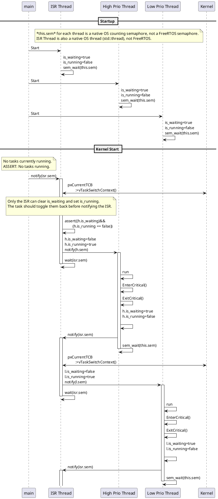

# A Port of FreeRTOS using modern C++ to emulate the OS.

The point of this project is to make emulation on Windows/macOS/Linux easier, but using modern cross-platform C++ primitives like std::thread.

## Design

The default operating mode does not support preemption. This is compatible with Windows/Linux/macOS.

macOS and Windows support thread suspension, so in these ports, preemption IS supported.

### Design without preemption

